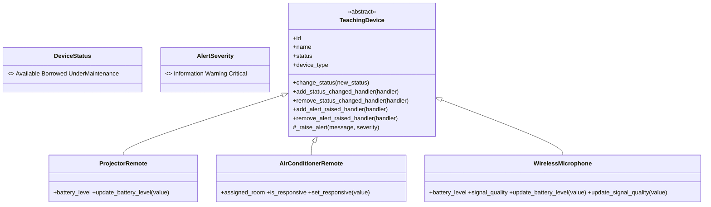

# So do lop - Giai doan 2

```mermaid
classDiagram
 class DeviceStatus {<<enumeration>> Available Borrowed UnderMaintenance}
 class AlertSeverity {<<enumeration>> Information Warning Critical}
 class TeachingDevice {
   <<abstract>>
   +id
   +name
   +status
   +device_type
   +change_status(new_status)
   +add_status_changed_handler(handler)
   +remove_status_changed_handler(handler)
   +add_alert_raised_handler(handler)
   +remove_alert_raised_handler(handler)
   #_raise_alert(message, severity)
 }
 class ProjectorRemote {+battery_level +update_battery_level(value)}
 class AirConditionerRemote {+assigned_room +is_responsive +set_responsive(value)}
 class WirelessMicrophone {+battery_level +signal_quality +update_battery_level(value) +update_signal_quality(value)}
 TeachingDevice <|-- ProjectorRemote
 TeachingDevice <|-- AirConditionerRemote
 TeachingDevice <|-- WirelessMicrophone
```
